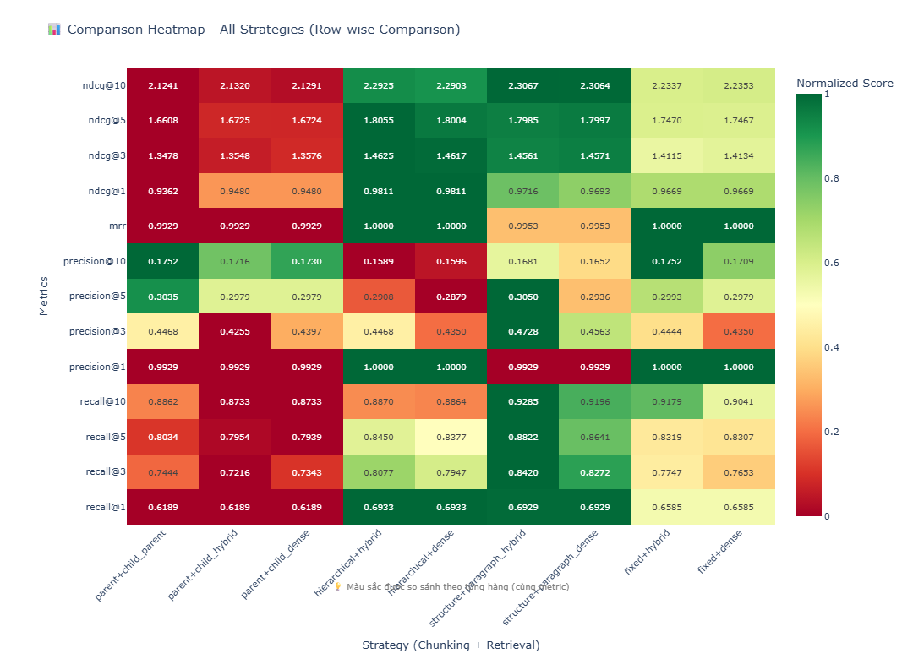

# Đánh giá các phương pháp Chunking và Retrieval

## Mô tả

Dự án này đánh giá hiệu quả của các phương pháp chunking và retrieval khác nhau cho hệ thống RAG (Retrieval-Augmented Generation) với tài liệu tiếng Việt.

## Các phương pháp Chunking

1. **Fixed Chunking**
   - Chia văn bản thành các chunk có kích thước cố định
   - Chunk size: 512 tokens
   - Overlap: 64 tokens

2. **Structure Paragraph Chunking**
   - Chia theo cấu trúc đoạn văn tự nhiên
   - Max chunk size: 600 tokens
   - Min chunk size: 100 tokens
   - Tự động gộp các đoạn văn ngắn

3. **Hierarchical Chunking**
   - Chia theo cấu trúc phân cấp: section → paragraph → sentence
   - Max chunk size: 800 tokens
   - Min chunk size: 150 tokens
   - Lưu trữ cấu trúc phân cấp

4. **Parent-Child Chunking**
   - Tạo hai cấp độ chunk: parent và child
   - Parent chunk size: 1000 tokens
   - Child chunk size: 250 tokens
   - Child overlap: 50 tokens

5. **Semantic Chunking**
   - Sử dụng model BGE-m3 để tính toán và phân tách chunk
   - Chia dựa trên ngữ nghĩa của văn bản
   - Tự động xác định ranh giới semantic

## Các phương pháp Retrieval

1. **Dense Retrieval**
   - Sử dụng embedding model: `Alibaba-NLP/gte-multilingual-base`
   - Vector dimension: 768
   - Distance metric: Cosine similarity
   - Vector database: Qdrant

2. **Hybrid Retrieval**
   - Kết hợp Dense retrieval và Sparse retrieval (BM25)
   - Dense weight: 0.7
   - Sparse weight: 0.3
   - Strategy: Weighted sum

3. **Parent Retrieval** (cho Parent-Child Chunking)
   - Retrieve ở cấp độ child chunks
   - Return ở cấp độ parent chunks
   - Aggregation: Max score

## Bộ dữ liệu đánh giá

Bộ đánh giá bao gồm **141 câu hỏi** được tạo từ các tài liệu tiếng Việt thuộc nhiều lĩnh vực khác nhau (văn bản pháp luật, tài liệu kỹ thuật, văn học). Bộ dữ liệu được thiết kế để đánh giá khả năng retrieval trong nhiều trường hợp:

- **Câu hỏi đơn giản**: Câu trả lời nằm trong 1 chunk duy nhất
- **Câu hỏi phức tạp**: Câu trả lời cần thông tin từ nhiều chunks khác nhau

Mỗi câu hỏi được gắn nhãn với các chunk có chứa câu trả lời chính xác để tính toán các metrics đánh giá.

## Kết quả đánh giá

### Kết luận

- **Structure Paragraph + Hybrid** cho kết quả tốt nhất về Recall@10 (0.9285) và NDCG@10 (2.3067)
- **Fixed + Hybrid/Dense** đạt MRR hoàn hảo (1.0000) và Precision@10 cao nhất (0.1752)
- **Hierarchical Chunking** cũng đạt MRR hoàn hảo với hiệu quả tốt
- **Parent-Child Chunking** cho kết quả thấp hơn các phương pháp khác trong dataset này

## Metrics

- **Recall@10**: Tỷ lệ các câu trả lời đúng được tìm thấy trong top 10 kết quả
- **Precision@10**: Độ chính xác của top 10 kết quả
- **MRR (Mean Reciprocal Rank)**: Trung bình nghịch đảo của vị trí kết quả đúng đầu tiên
- **NDCG@10**: Normalized Discounted Cumulative Gain - đánh giá chất lượng ranking
